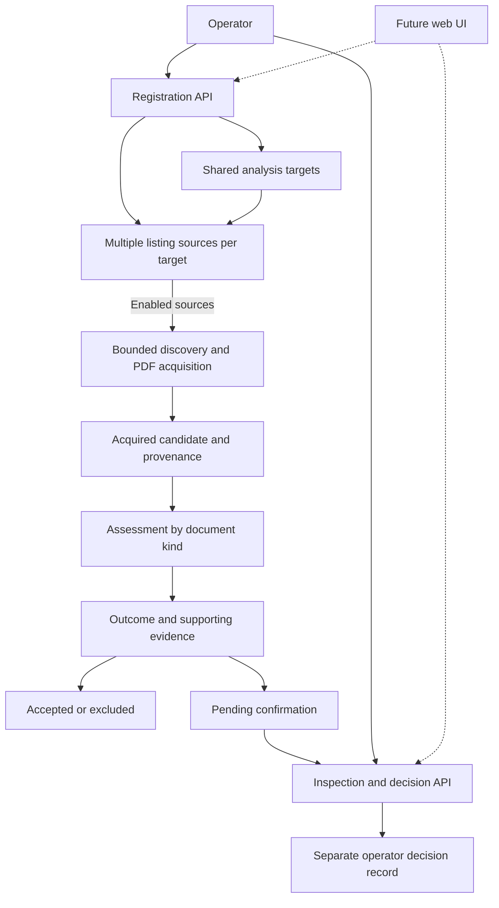
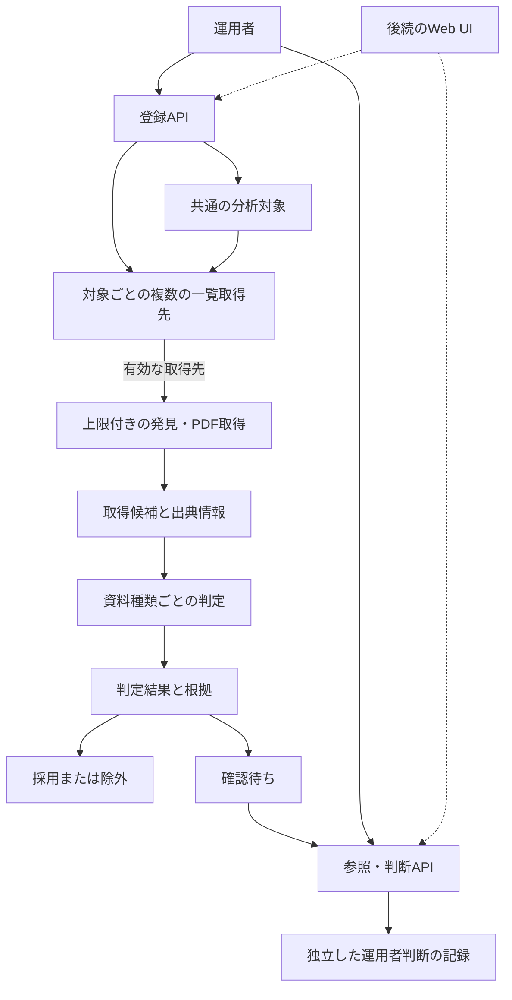

# Register collection targets through an operator interface

Limit the initial earnings pilot to a small set of targets chosen by the operator. Provide an API for registering and changing targets and acquisition sources instead of embedding a supported company set in code or documentation. Extend this interface with separate crawling, document assessment and evidence recording so that changing targets reduces operator setup and checking work as well as code changes.

## Registration and collection boundary

Reuse `analysis_targets` as the shared security registry. Associate multiple acquisition sources with each target instead of maintaining a separate company registry. A source URL denotes a document listing page; it is not a direct-document URL. Registration alone does not establish a document's company, category or reporting identity.

Keep acquisition enablement per source, independent of the target's `active` flag. New sources default to enabled when the setting is omitted; operators can explicitly register a disabled source or stop an existing one. Registering a target alone does not create sources or start acquisition. Enablement makes a source eligible for collection; it does not specify when a crawl runs.

Source registration uses an existing target ID and `listing_url`, with optional `enabled`; no additional source name or classifier settings are required. Reject duplicate listing URLs within one target. A source's target is fixed after registration, while its listing URL and enablement can change. Register a separate source for another target rather than reassigning its identity.

Do not automatically import the former fixed three-company catalog or create targets during migration. Operators register their chosen targets and listing sources through the API. Preserve existing originals, acquisition records and HTTP checks independently of current source configuration; historical issuers do not require a newly registered source.

Operators review acquisition and preservation conditions before registering or enabling an active source. Keep that review in the operating procedure rather than introducing a separate reviewed/approved state or approval gate in the application. Automated interpretation of publisher terms is outside this decision.

The initial acquisition implementation supports PDFs, but source registration must not require PDF-specific fields or a document-format declaration. Discover published document links from the registered listing and handle external document hosts without routine manual host configuration. Registration and crawling do not depend on a particular document-category classifier. Existing request and response-size bounds remain applicable; detailed URL validation and transport behavior belong to implementation.

## Registration migration and compatibility

Keep the HTTP registration contract, examples and validation rules in the [generated OpenAPI reference](https://9renpoto.github.io/lens/). Keep the registration decisions and migration/compatibility contract in this ADR rather than adding a separate source-registration reference. The API publishing and local generation procedure is in [API documentation](../api.md).

Apply `mix ecto.migrate` before serving the registration API. `20261006000000` creates `earnings_sources` with a restricted target foreign key, per-target URL uniqueness and enabled-by-default rows, without importing the former catalog or creating targets. The 2048-byte listing URL bound keeps full-URL uniqueness within PostgreSQL's index entry bound. Operators manually register any former pilot routes they want to retain.

`20261006000100` replaces the former three-issuer restriction in `earnings_http_check_bounds` with a nonblank issuer code of 1–50 characters. Request counts, HTTP status and PDF/listing byte caps remain enforced. Existing original, acquisition, HTTP check and assessment rows and history immutability triggers are preserved. Historical checks need no registered source. `HTTPHistory.record/1` retains its input/result contract and persistence retries for previous issuer codes. Source changes do not relabel historical URLs or issuers.

Whitelist removal is forward-only: rollback could reject new issuer history. Its `down` migration fails explicitly rather than deleting history or restoring an incompatible constraint. Use a coordinated pre-migration backup if restoring the old schema is necessary.

The existing `/api/sources` feed API and `/api/targets` responses retain their contracts. `SourceCatalog.all/0` reads registered sources and current target names; `all(enabled_only: true)` filters only by source enablement. `for_issuer/1` returns all routes. `fetch/1` returns a route only when exactly one is registered, `:unsupported_issuer` for none, or `:multiple_sources` for multiple routes, including disabled ones. The obsolete fixed host/path helper `document_url_allowed?/2` is removed. Registration supplies no document URL permission policy: HTTP acquisition still requires an explicit `allowed_url?` predicate for the initial URL and every redirect. Registered-source crawling and its external-host policy remain #125 work; fixed-issuer classifier changes remain #127 work.

Verify forward migration against an empty disposable database:

```sh
MIX_ENV=test POSTGRES_DB=lens_source_migration_check mix ecto.create
MIX_ENV=test POSTGRES_DB=lens_source_migration_check mix run --no-start test/system/earnings_source_migration_check.exs
```

The check seeds old-schema successes and a failure, compares prior original/acquisition/check/target rows after migration, verifies no automatic source import, changes source settings without changing history, exercises existing persistence callers and new issuers, and verifies history immutability. API tests cover a synthetic non-pilot `7203` target with no membership and `active: false`, multiple sources, defaults, explicit false, partial updates, duplicates, isolation and URL validation. Existing feed/target tests cover client compatibility, and HTTP history tests cover non-pilot listing/PDF checks and retained bounds. These deterministic checks do not establish live publisher access or local k3s verification; the broader workflow remains #131 work.

## Assessment and recording boundary

Assess whether an acquired candidate is a supported earnings document for the registered target, then record the outcome and its supporting evidence through a shared contract. Implement assessment by document kind, in this priority order: earnings releases, corrections, then earnings-presentation materials. This is delivery priority, not a requirement to run classifiers in that order.

Keep acquired originals and acquisition facts distinct from automated assessments and later operator decisions. Unknown or contradictory identity remains pending confirmation rather than being fabricated. A pending candidate does not block processing of other candidates.

Provide an API to list pending candidates, inspect results and evidence, and record adoption or exclusion. Adoption must not invent missing release identity or silently merge releases. Add a web UI later using the same API. The assessment method, including whether any model is used, is not selected by this ADR.

The diagram shows responsibility and information boundaries, not a prescribed database schema, job framework or synchronous execution sequence.



## Trade-offs and consequences

A fixed catalog is simpler initially, but changing supported companies requires code changes and deployment. A second company registry would also duplicate existing target information. Reusing targets and persisting acquisition sources adds migration and API work while allowing operators to change the pilot without code changes.

Requiring manual host/path configuration would move that work to operators instead of reducing it. Separating acquisition from assessment allows document kinds to be added independently; shared evidence records make uncertain results inspectable. Deferring the web UI keeps the initial interface small while preserving an API for later operator workflows. Default enablement keeps registration short, with pre-registration condition review remaining an operator responsibility.

Preserve existing acquisition and assessment history when configuration changes. Replace fixed issuer restrictions through forward migrations rather than rewriting applied migrations. Precise registration fields, update semantics, evidence schemas, API endpoints and classifier behavior are decided in the implementation tasks under these boundaries. This ADR does not promise HTML/XBRL acquisition, financial analysis or RustFS delivery.

Use the operator's local k3s Lens instance for deployment-level pilot verification. Focused automated tests and TDD remain necessary for production changes; neither an accepted ADR nor created issues establish completed implementation or verification.

Implementation is tracked by direct sub-issues of the release tracker [#68](https://github.com/9renpoto/lens/issues/68):

- [#124: source registration API and persistence](https://github.com/9renpoto/lens/issues/124).
- [#125: crawling registered listings](https://github.com/9renpoto/lens/issues/125).
- [#126: shared assessment and evidence records](https://github.com/9renpoto/lens/issues/126).
- [#127: earnings-release assessment](https://github.com/9renpoto/lens/issues/127).
- [#128: correction assessment](https://github.com/9renpoto/lens/issues/128).
- [#129: earnings-presentation assessment](https://github.com/9renpoto/lens/issues/129).
- [#130: pending-candidate operator API](https://github.com/9renpoto/lens/issues/130).
- [#131: operation documentation and verification](https://github.com/9renpoto/lens/issues/131).

Existing #69–#74 retain their historical scope and foundations; the new tasks coordinate follow-up work. Domain terms are defined in [the glossary](../../CONTEXT.md). Follow the [ADR maintenance policy](README.md); this record remains usable after temporary planning documents are removed before the v0.2 tag.

<details>
<summary>日本語</summary>

# 運用者向けインターフェースから収集対象を登録する

初期の決算情報パイロットは、運用者が選ぶ少数の対象に限定する。対応企業をコードや文書に固定せず、対象と取得先を登録・変更するAPIを設ける。このインターフェースを、独立したクローリング・資料判定・根拠の記録へ拡張し、対象の変更に伴うコード変更だけでなく、運用者の設定・確認作業も減らす。

## 登録と収集の境界

`analysis_targets`を共通の銘柄台帳として再利用する。企業台帳を別に持たず、対象ごとに複数の取得先を関連付ける。取得先URLは資料一覧ページを示し、資料を直接指すURLではない。登録だけでは資料の企業・種類・対象期間の識別は確定しない。

取得先ごとの有効状態を、対象の`active`と独立させる。新規取得先は指定を省略すると有効とし、運用者が明示的に無効で登録したり、既存取得先を停止したりできる。対象の登録だけでは取得先を作成せず、取得を開始しない。有効化は収集対象となることを意味し、クローリングの実行時期を指定するものではない。

取得先登録には既存対象のIDと`listing_url`を使い、`enabled`を任意項目とする。取得先固有の名称や判定設定は必須にしない。同じ対象内で一覧URLの重複を拒否する。登録後の対象は固定し、一覧URLと有効状態は変更できる。別の対象には取得先を新規登録し、既存取得先の同一性を付け替えない。

移行では従来の固定3社の台帳を自動取り込みせず、対象も作成しない。運用者が選んだ対象と一覧取得先をAPIから登録する。既存原本・取得記録・HTTP確認記録は現在の取得先設定と独立して保持し、過去の企業に取得先の新規登録を要求しない。

運用者は、有効な取得先を登録または有効化する前に、取得・保存の条件を確認する。アプリに確認済み・承認済みの別状態や承認による有効化の制限を設けず、確認は運用手順に残す。発行元の利用条件の自動解釈はこの決定に含めない。

初期の取得実装はPDFに対応するが、取得先登録ではPDF固有の項目や資料形式の指定を必須にしない。登録した一覧から公開された資料リンクを発見し、通常の手動ドメイン設定なしで外部の資料ドメインにも対応する。登録・クローリングは特定の資料種類の判定処理に依存させない。既存のリクエスト・応答サイズの上限を引き続き適用し、詳細なURL検証と取得時の挙動は実装で決める。

## 登録の移行と互換性

HTTP登録の契約・例・検証規則は[生成OpenAPIリファレンス](https://9renpoto.github.io/lens/)に集約する。登録方針と移行・互換性の契約は、独立した取得先登録の参照資料を追加せず、このADRに保持する。APIの公開とローカル生成の手順は[APIドキュメント](../api.md)に記載する。

登録APIを提供する前に`mix ecto.migrate`を適用する。`20261006000000`は、対象削除を制限する外部キー、対象ごとのURL一意性、有効が既定の行を持つ`earnings_sources`を作成し、従来の台帳の取り込みや対象の作成は行わない。一覧URLの2048バイト上限により完全なURLの一意性インデックスもPostgreSQLのインデックス項目上限に収まる。従来のパイロット経路を引き続き使う場合も、運用者が手動登録する。

`20261006000100`は`earnings_http_check_bounds`の固定3社制限を、空白だけではない1〜50文字の企業コードに置き換える。リクエスト回数・HTTPステータス・PDF／一覧のバイト上限は維持する。既存の原本・取得・HTTP確認・判定の行と履歴変更禁止トリガーを保持する。過去の確認履歴には取得先登録を要求しない。`HTTPHistory.record/1`の入力・結果契約と以前の企業コードでの保存再試行を維持する。取得先変更で過去のURLや企業を付け替えない。

企業制限の解除は前進専用とする。戻すと新しい企業の履歴を拒否し得るため、`down`マイグレーションは履歴削除や互換性のない制約の復元を行わず、明示的に失敗する。旧スキーマへの復元が必要なら、移行前の整合したバックアップを使う。

既存のフィードAPI `/api/sources`と`/api/targets`応答の契約を維持する。`SourceCatalog.all/0`は登録取得先と現在の対象名を読み、`all(enabled_only: true)`は取得先の有効状態だけで絞る。`for_issuer/1`は全経路を返す。`fetch/1`は登録がちょうど1件の場合だけその経路を返し、0件なら`:unsupported_issuer`、無効な取得先も含め複数なら`:multiple_sources`を返す。固定ホスト・パス用の古い関数`document_url_allowed?/2`は削除する。登録は資料URLの取得許可ポリシーを提供しない。HTTP取得には引き続き初期URLと各リダイレクト先に適用する明示的な`allowed_url?`判定が必要。登録取得先のクローリングと外部ホストのポリシーは#125、固定企業の判定器変更は#127の作業として残る。

空の使い捨てDBで前進マイグレーションを検証する：

```sh
MIX_ENV=test POSTGRES_DB=lens_source_migration_check mix ecto.create
MIX_ENV=test POSTGRES_DB=lens_source_migration_check mix run --no-start test/system/earnings_source_migration_check.exs
```

旧スキーマに成功と失敗の記録を作り、移行後に既存の原本／取得／確認／対象の行を比較する。自動取得先取り込みがないこと、設定変更で履歴が変わらないこと、既存の保存呼び出しと新しい企業、履歴の変更禁止を確認する。APIテストでは固定3社外の合成対象`7203`を使い、所属なし・`active: false`、複数取得先、既定値、明示的なfalse、部分更新、重複、対象の分離、URL検証を確認する。既存のフィード／対象テストでクライアント互換性を確認し、HTTP履歴テストで固定3社外の一覧／PDF確認と維持した上限を検証する。この再現可能な検証は実サイトへのアクセスやローカルk3sでの検証を証明しない。広いフローは#131の作業として残る。

## 判定と記録の境界

取得した候補が登録対象の対応する決算資料かを判定し、共通の契約で結果と根拠を記録する。判定は資料種類ごとに実装し、決算短信、訂正資料、決算説明会資料の順で優先する。これは実装の優先順位であり、判定処理をこの順番で実行する要件ではない。

取得した原本と取得事実は、自動判定や後の運用者判断と区別する。不明・矛盾する識別情報は捏造せず確認待ちに残す。確認待ちの候補がほかの候補の処理を止めないようにする。

確認待ち候補の一覧、結果と根拠の参照、採用・除外の記録APIを提供する。採用によって欠けた短信識別を捏造したり、短信を黙って統合したりしない。Web UIは同じAPIを使って後から追加する。モデルを利用するかも含め、判定方法はこのADRでは選定しない。

以下の図は責務と情報の境界を示し、DBスキーマ、ジョブの仕組み、同期的な実行順序を指定するものではない。



## トレードオフと影響

固定台帳は当初の実装が簡単だが、対応企業の変更にコード変更とデプロイが必要となる。別の企業台帳を設けると、既存の対象情報も重複する。対象の再利用と取得先の永続化には移行・APIの作業が増えるが、運用者がコード変更なしで対象を変えられる。

ドメイン・パスの手動設定を必須にすると、その作業を減らさず運用者へ移すことになる。取得と判定を分離すれば、資料種類ごとに独立して対応を追加でき、共通の根拠記録により不確かな結果を確認できる。Web UIを後回しにすれば初期のインターフェースを小さく保ち、後続の運用操作にもAPIを使える。有効を既定にすることで登録を簡潔にし、登録前の条件確認は運用者の責任として残す。

設定変更時も既存の取得・判定履歴を保持する。適用済みマイグレーションを書き換えず、追加マイグレーションで固定企業の制限を置き換える。詳細な登録項目・更新の意味・根拠のスキーマ・APIエンドポイント・判定処理は、この境界のもとで実装タスク内で決める。このADRではHTML・XBRL取得、財務分析、RustFSの実装を約束しない。

実環境でのパイロット検証は、運用者のローカルk3s上のLensを使う。本番変更には引き続き対象を絞った自動テストとTDDが必要。ADRの承認やIssue作成は、実装・検証の完了を意味しない。

実装は、リリース管理[#68](https://github.com/9renpoto/lens/issues/68)の直接のサブIssueで追跡する。

- [#124：取得先の登録APIと永続化](https://github.com/9renpoto/lens/issues/124)。
- [#125：登録した一覧のクローリング](https://github.com/9renpoto/lens/issues/125)。
- [#126：共通の判定・根拠の記録](https://github.com/9renpoto/lens/issues/126)。
- [#127：決算短信の判定](https://github.com/9renpoto/lens/issues/127)。
- [#128：訂正資料の判定](https://github.com/9renpoto/lens/issues/128)。
- [#129：決算説明会資料の判定](https://github.com/9renpoto/lens/issues/129)。
- [#130：確認待ち候補の操作API](https://github.com/9renpoto/lens/issues/130)。
- [#131：運用文書と検証](https://github.com/9renpoto/lens/issues/131)。

既存#69〜#74の従来の範囲と基盤を維持し、新しいタスクで後続作業を連携する。ドメイン用語は[用語集](../../CONTEXT.md)に定義する。[ADR管理方針](README.md)に従い、v0.2タグ前に一時的なPlanning文書を削除した後も、この記録を参照できるようにする。

</details>
