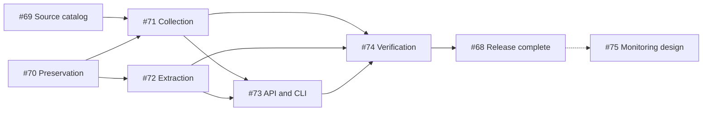

# v0.2 issue breakdown

Status: published and verified. The [v0.2 milestone](https://github.com/9renpoto/lens/milestone/2)
contains [tracker #68](https://github.com/9renpoto/lens/issues/68) and six delivery
issues; [monitoring design #75](https://github.com/9renpoto/lens/issues/75) is
unmilestoned. Agreed scope and delegated implementation choices live in
[the release plan](next-minor-plan.md).

## Implementation tasks

The P/F identifiers below are retained planning aliases. Their GitHub issue
numbers, standalone bilingual bodies, and acceptance checklists are linked in the
[reviewable issue packet](#reviewable-issue-packet).

| ID | Task boundary | Acceptance focus | Depends on |
| --- | --- | --- | --- |
| P1 | Validate the fixed three-company source catalog | Dated selection evidence; official listing and original URLs; source conditions; latest-release rule; representative PDF samples | None |
| P2 | Preserve originals and acquisition records | PostgreSQL originals; release identity; immutable distinct bytes; acquisition history; 20 MiB limit; explicit failures | None |
| P3 | Discover and collect earnings PDFs | Latest initial release, subsequent new listings, bounded daily/manual runs, safe retries, unchanged feed behavior | P1, P2 |
| P4 | Extract and regenerate searchable text | Text-bearing PDF extraction; explicit failure state; raw original survives failure; offline regeneration; retry behavior | P2 |
| P5 | Expose searchable earnings and original provenance | API/CLI; one result per release; latest successful extraction; stale-text indication; originals and unresolved states | P3, P4 |
| P6 | Verify preservation and recovery end to end | Three-company acceptance corpus; failure injection; restart, backup/restore, raw-byte integrity, extraction and search after restore | P3, P4, P5 |
| F1 | Define saved searches and new-publication monitoring | Baseline, publication versus discovery, matching identity, late arrivals, delivery semantics | Follow-up after v0.2 foundations |

P1 is a bounded investigation. Remaining unknown acquisition conditions should
be resolved there; unverified access is not an implementation permission.
Source-adapter work can be split by company after P1 if discovery paths require
meaningfully different implementations.

## Reviewable issue packet

| Planning ID / GitHub issue | Local issue body | Milestone |
| --- | --- | --- |
| P0 / [#68](https://github.com/9renpoto/lens/issues/68) | [Release tracker](planning/v0.2/P0-release-tracker.md) | v0.2 |
| P1 / [#69](https://github.com/9renpoto/lens/issues/69) | [Official source catalog](planning/v0.2/P1-source-catalog.md) | v0.2 |
| P2 / [#70](https://github.com/9renpoto/lens/issues/70) | [Original preservation](planning/v0.2/P2-preservation.md) | v0.2 |
| P3 / [#71](https://github.com/9renpoto/lens/issues/71) | [Daily and manual collection](planning/v0.2/P3-collection.md) | v0.2 |
| P4 / [#72](https://github.com/9renpoto/lens/issues/72) | [Text extraction and regeneration](planning/v0.2/P4-extraction.md) | v0.2 |
| P5 / [#73](https://github.com/9renpoto/lens/issues/73) | [Search, originals, and status API/CLI](planning/v0.2/P5-api-cli.md) | v0.2 |
| P6 / [#74](https://github.com/9renpoto/lens/issues/74) | [End-to-end and recovery verification](planning/v0.2/P6-verification.md) | v0.2 |
| F1 / [#75](https://github.com/9renpoto/lens/issues/75) | [Saved-search monitoring design](planning/v0.2/F1-monitoring.md) | None; follow-up |

### GitHub publication record

After final confirmation and a duplicate check, the milestone and eight issues
were created. #69–#74 are the six sub-issues of #68. The nine blocking edges
were registered and read back: #71 depends on #69/#70; #72 on #70; #73 on
#71/#72; #74 on #71/#72/#73; #75 on #68. Tracker completion is a checklist
condition, not a circular blocking relationship. Existing open issues retained
their titles, bodies, states, milestone assignments, labels, and assignees.

Published bodies use actual issue links. At creation time the planning packet
was unpublished, so the GitHub bodies identify it by repository path. This PR
publishes the packet at those paths; the GitHub issues remain the source of truth
for current status. No implementation thread, version bump, application release,
or change to the already-empty v0.1 milestone was made during the planning task.

## Existing open issues

Inventory verified on 2026-09-15. All ten issues were open and had no milestone.
The agreed disposition is to preserve these issues outside v0.2 and connect
related work without expanding their scope.

| Issue | Existing responsibility | Agreed disposition |
| --- | --- | --- |
| [#43](https://github.com/9renpoto/lens/issues/43) | Target/security attributes and historical Nikkei membership; excludes weighting model | Keep as follow-up; a fixed pilot catalog does not require full historical membership |
| [#47](https://github.com/9renpoto/lens/issues/47) | Target/membership JSON import, dependent on #43 | Keep with #43 |
| [#48](https://github.com/9renpoto/lens/issues/48) | Reviewed document-target/category association, dependent on #43 | Keep review workflow as follow-up; pilot provenance must identify its configured issuer |
| [#51](https://github.com/9renpoto/lens/issues/51) | Target/category/review/date/membership search filters, dependent on #48 and completed #46 | Keep broader filtering as follow-up; does not implement saved-search monitoring |
| [#49](https://github.com/9renpoto/lens/issues/49) | Paginated existing observation-provenance API, dependent on completed #45 | Keep independent; its explicit API-only boundary excludes new storage/ingestion |
| [#50](https://github.com/9renpoto/lens/issues/50) | Analytical claims and immutable cited evidence, dependent on #43 and completed #45 | Follow-up; original acquisition is independent of analytical claims and operator snapshots |
| [#53](https://github.com/9renpoto/lens/issues/53) | Analysis verification/export gates, dependent on #50/#49 | Keep with analysis work |
| [#44](https://github.com/9renpoto/lens/issues/44) | RSSHub k3s operational baseline | Keep independent infrastructure work |
| [#54](https://github.com/9renpoto/lens/issues/54) | 24-hour RSSHub stability/recovery, dependent on #44 | Keep with RSSHub work |
| [#55](https://github.com/9renpoto/lens/issues/55) | One-hour new-format/provenance/CJK integration, dependent on #44/#49 and completed #52 | Preserve this existing purpose; P6 validates original-file acquisition and recovery separately |

Completed foundations include #40 (RSS 1.0), #41 (acquisition/publisher
classification), #42 (Japanese search evaluation), #45 (observation provenance),
#46 (rebuildable CJK search), and #52 (scheduler integration harness).

## Handoff requirements

- Link the relevant ADR, source-catalog evidence, and prerequisite issues.
- State observable success and failure behavior; distinguish agreed contracts
  from implementation choices delegated to the implementer.
- Preserve existing feed behavior and do not require fabricating original files
  for historical Documents.
- Follow repository TDD instructions for production changes. Use local fixtures
  for deterministic tests; live-source checks are separate operator evidence.
- Record focused checks and required repository checks in each implementation PR.
- This planning session does not start implementation tasks or create model
  threads; those are separate user-directed work.
- English is the main documentation text; provide corresponding Japanese in
  closed-by-default `
` blocks and update both together.

日本語

# v0.2のissue分解

状態：登録・確認済み。[v0.2マイルストーン](https://github.com/9renpoto/lens/milestone/2)には[親issue #68](https://github.com/9renpoto/lens/issues/68)と6件の実施issueを登録し、[監視設計 #75](https://github.com/9renpoto/lens/issues/75)はマイルストーン未設定。合意した範囲と実装担当に委ねる選択は[リリース計画](next-minor-plan.md)を参照。

## 実装タスク

以下のP・FのIDは計画内の別名として残している。[レビュー用issue一式](#reviewable-issue-packet)に、実際のGitHub issue番号・独立した日英併記本文・受入チェックリストをリンクしている。

| ID | タスクの境界 | 主な受入条件 | 依存先 |
| --- | --- | --- | --- |
| P1 | 固定3社の取得元台帳を検証する | 基準日付きの選定根拠、公式一覧・原本URL、取得条件、最新資料の選択規則、代表PDF | なし |
| P2 | 原本と取得記録を保存する | PostgreSQLへの原本保存、短信の識別、異なるバイト列の不変保持、取得履歴、20 MiB上限、失敗の明示 | なし |
| P3 | 決算PDFを発見・取得する | 初回の最新資料と以降の新規掲載資料、上限付きの日次・手動実行、安全な再試行、既存フィード動作の維持 | P1、P2 |
| P4 | 検索用本文を抽出・再生成する | 文字情報を持つPDFの抽出、失敗状態の明示、失敗しても原本保持、外部取得なしの再生成、再試行 | P2 |
| P5 | 決算情報の検索と原本の出典情報を提供する | API・CLI、短信ごとに1件、最新の抽出成功版、旧版本文の表示、原本と未解決状態 | P3、P4 |
| P6 | 保存と復元を一連の流れで検証する | 3社の評価用資料群、障害注入、再起動、バックアップ・復元、原本バイト列の整合性、復元後の抽出・検索 | P3、P4、P5 |
| F1 | 保存検索と新規公開の監視を定義する | 初期基準、公開と発見の区別、一致情報の同一性、遅れて発見した資料、結果の届け方 | v0.2の基盤に続く後続課題 |

P1は範囲を限定した調査タスク。未確認の取得条件はここで解決する。アクセス方法が未検証であることを、実装上の取得許可とは扱わない。一覧からの発見方法が企業ごとに大きく異なる場合、P1の後で取得アダプターの実装を企業別に分けられる。

## レビュー用issue一式

| 計画ID / GitHub issue | ローカルのissue本文 | マイルストーン |
| --- | --- | --- |
| P0 / [#68](https://github.com/9renpoto/lens/issues/68) | [リリースの親issue](planning/v0.2/P0-release-tracker.md) | v0.2 |
| P1 / [#69](https://github.com/9renpoto/lens/issues/69) | [公式の取得元台帳](planning/v0.2/P1-source-catalog.md) | v0.2 |
| P2 / [#70](https://github.com/9renpoto/lens/issues/70) | [原本保存](planning/v0.2/P2-preservation.md) | v0.2 |
| P3 / [#71](https://github.com/9renpoto/lens/issues/71) | [日次・手動収集](planning/v0.2/P3-collection.md) | v0.2 |
| P4 / [#72](https://github.com/9renpoto/lens/issues/72) | [本文抽出・再生成](planning/v0.2/P4-extraction.md) | v0.2 |
| P5 / [#73](https://github.com/9renpoto/lens/issues/73) | [検索・原本・状態のAPIとCLI](planning/v0.2/P5-api-cli.md) | v0.2 |
| P6 / [#74](https://github.com/9renpoto/lens/issues/74) | [一連の動作と復元の検証](planning/v0.2/P6-verification.md) | v0.2 |
| F1 / [#75](https://github.com/9renpoto/lens/issues/75) | [保存検索による監視の設計](planning/v0.2/F1-monitoring.md) | 未設定・後続 |

依存順序は、P1・P2→P3、P2→P4、P3・P4→P5、P3・P4・P5→P6。P0は全体の完了を管理し、F1はその後に置く。

### GitHubへの登録記録

全体の共通認識と重複を確認後、マイルストーンと8件を作成した。#69〜#74を#68の6件の子issueとして登録した。依存関係は、#71←#69・#70、#72←#70、#73←#71・#72、#74←#71・#72・#73、#75←#68の9件を登録し、読み直して確認した。親issueの完了はチェックリストの管理条件であり、循環する依存関係は作っていない。既存の未完了issueはタイトル・本文・状態・マイルストーン・ラベル・担当者を維持した。

公開本文は実際のissueリンクを使う。計画packetの作成時は未公開だったため、GitHub本文にはリポジトリ内のパスを記載した。このPRで同じパスにpacketを公開する。現在の状態はGitHub issueを正とする。計画作業では、実装スレッドの作成・バージョン変更・アプリのリリース・未完了issueが0件のv0.1マイルストーンの変更は行っていない。

## 既存の未完了issue

2026-09-15に確認した10件は、いずれも未完了かつマイルストーン未設定。これらはv0.2の外に残し、範囲を拡張せず関連作業をリンクする方針で合意している。

| issue | 既存の責務 | 合意した扱い |
| --- | --- | --- |
| [#43](https://github.com/9renpoto/lens/issues/43) | 対象企業・証券属性と日経平均構成銘柄の履歴。構成比率モデルは対象外 | 後続に残す。固定パイロット台帳に構成銘柄の全履歴は不要 |
| [#47](https://github.com/9renpoto/lens/issues/47) | #43に依存する対象・構成銘柄情報のJSON取込 | #43とともに扱う |
| [#48](https://github.com/9renpoto/lens/issues/48) | #43に依存する、レビュー付きのDocumentと対象・分類の関連付け | レビューは後続。パイロットの出典情報では設定した企業を識別する |
| [#51](https://github.com/9renpoto/lens/issues/51) | #48と完了済み#46に依存する、対象・分類・レビュー・日付・構成銘柄履歴による絞り込み | 広範な絞り込みは後続。保存検索の監視機能とは区別する |
| [#49](https://github.com/9renpoto/lens/issues/49) | 完了済み#45に依存する、既存Observationの出典履歴のページ付きAPI | 独立して維持。APIのみという明示的な境界に、新規保存・収集を混ぜない |
| [#50](https://github.com/9renpoto/lens/issues/50) | #43と完了済み#45に依存する、分析上の主張と不変の引用根拠 | 後続。原本取得は分析上の主張や手動スナップショットから独立させる |
| [#53](https://github.com/9renpoto/lens/issues/53) | #50・#49に依存する、分析の検証とエクスポート条件 | 分析関連の作業として維持 |
| [#44](https://github.com/9renpoto/lens/issues/44) | RSSHubのk3s運用基盤 | 独立したインフラ作業として維持 |
| [#54](https://github.com/9renpoto/lens/issues/54) | #44に依存する、RSSHubの24時間安定性・復旧検証 | RSSHub関連の作業として維持 |
| [#55](https://github.com/9renpoto/lens/issues/55) | #44・#49と完了済み#52に依存する、新形式・出典・CJK検索の1時間統合検証 | 既存の目的を維持。P6では原本ファイルの取得と復元を別途検証 |

完了済みの基盤には、#40（RSS 1.0）、#41（取得方法と発行主体の分類）、#42（日本語検索の評価）、#45（Observationの出典情報）、#46（再構築可能なCJK検索）、#52（スケジューラー統合テスト基盤）がある。

## 実装担当への引き継ぎ要件

- 関連ADR、取得元台帳の根拠、前提となるissueをリンクする。
- 外から確認できる成功・失敗時の挙動を記載し、合意した契約と実装担当に委ねる選択を分ける。
- 既存フィードの動作を維持し、過去のDocumentに架空の原本を作ることを要求しない。
- 本番コードの変更はリポジトリのTDD指示に従う。決定的なテストにはローカルの固定データを使い、実際の取得先での確認は別の運用証跡とする。
- 各実装PRに、対象を絞った検証とリポジトリ所定の検証結果を記録する。
- この計画セッションでは実装タスクやモデルの別スレッドを起動しない。別途ユーザーが指示する作業として扱う。
- ドキュメントは英語を本文とし、対応する日本語を初期状態で閉じた`
`内に置き、両言語を同時に更新する。

